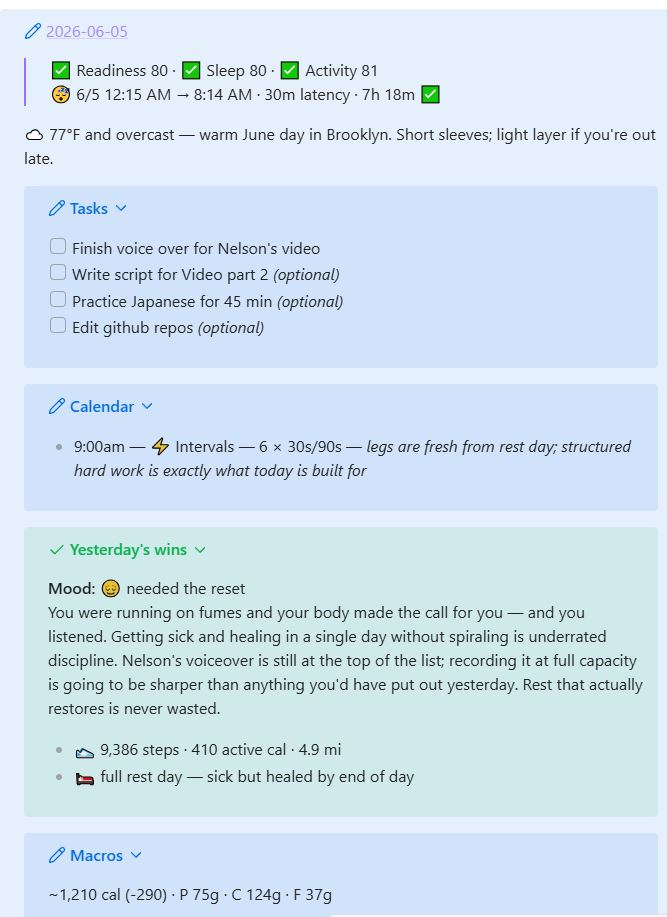
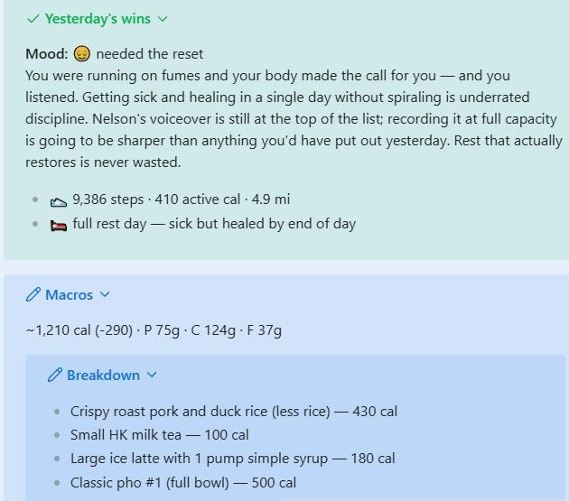
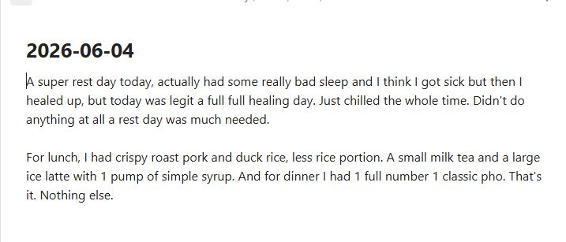

# Obsidian Daily Brief Agent

A personal morning agent built with Claude Code that runs inside an Obsidian vault. One command processes the previous day's journal and assembles a structured daily brief — pulling live data from multiple APIs and cross-referencing the vault automatically.

## Output

 

The brief opens live each morning with biometrics, weather, tasks, calendar, a mood-read of yesterday, and a macro tally — all collapsed into a single Obsidian note.

## How it works

Three inputs feed one output.

**1. Yesterday's journal** — a raw freeform note you drop in the vault root.



**2. Oura Ring** — sleep, readiness, and activity scores pulled live from the API.


**3. Priority List** — a flat note in the vault listing Must Do / In Mind / Reach items.


The agent reads all three, calls the weather API, and writes the formatted brief in one pass.

The agent is defined entirely in `CLAUDE.md` — a structured instruction file that Claude Code reads as its operating context. When invoked, Claude executes the two-phase workflow: parsing unstructured journal text, making API calls, navigating the vault's folder hierarchy, and writing formatted Obsidian callout blocks — all without any traditional code.

## What it does

**Processes yesterday's journal:**
- Extracts tasks, people, projects touched, and food logged
- Creates or updates person notes and project status flags in the vault
- Relocates the raw journal file into the correct dated archive folder

**Builds today's brief:**
- Sleep score, readiness, and activity data via the Oura Ring API
- Local weather via open-meteo
- Prioritized task list with auto-applied action verbs and progress labels
- Calendar events for the day
- Wins + mood summary derived from yesterday's journal tone
- Macro estimate from food mentions, benchmarked against daily nutrition targets

## How to run

Make sure [Claude Code](https://claude.ai/code) is installed, then open your Obsidian vault as the working directory.

**Desktop app** — Open Claude Code, click the folder icon to set your project, and navigate to your Obsidian vault. Then tell it:
```
Run the daily brief agent in CLAUDE.md
```

**macOS terminal**
```bash
cd ~/path/to/your/vault
claude
```

**Windows terminal**
```cmd
cd C:\path\to\your\vault
claude
```

> Replace the path with wherever your Obsidian vault lives. On Mac it's typically `~/Documents/VaultName`. On Windows, `C:\Users\YourName\Documents\VaultName`.

## Stack

- Claude Code (agent runtime)
- Oura Ring API (biometric data)
- open-meteo API (weather)
- Obsidian (vault / output target)
